# About the project
This project is about solving business problem in retail business marketing campaign. Sci Mart is a retail business, having poor marketing campaign result 
on last campaign wants to solve this problem with help of data science knowledge. Avalaible resources for this problem are historical customer marketing 
campaign data.

# Problem, Goals and Objective
Based on data Sci Mart having problem with <b>low response rate 14.90% and low profit -$3.046</b>

Goals:
- Increase response rate
- Increase profit

Objective :
- Create model to predict customer resonse

Business metric :
- Response rate

# Getting Started
To run this project you will need Jupyter notebook. Project having some stages on it's process and combined in source_code_master.ipynb.

## Built with
- [![Python][Python.com]][Python-url]
- [![Jupyter][Jupyter.com]][Jupyter-url]
<!-- - [![pandas][pandas.com]][pandas-url] -->
- <a href="https://pandas.pydata.org/">
    
  </a>

<!-- - [![matplotlib][matplotlib.com]][matplotlib-url] -->
- <a href="https://matplotlib.org/stable/index.html">
    
  </a>
<!-- - [![seaborn][seaborn.com]][seaborn-url] -->
- <a href="https://seaborn.pydata.org/index.html">
    
  </a>


## Prerequisites
These are some library you need to run the project, i put the pip installation to make it easy for you.


* Pandas
  ```sh
  pip install pandas
  ```
* Matplotlib
  ```sh
  pip install matplotlib
  ```
* Seaborn
  ```sh
  pip install seaborn
  ```
* sklearn
  ```sh
  pip install sklearn
  ```

# Exploratory Data
Data are having 2240 rows and 29 columns. Features are divide to 4 type : demographic, spending (monetary), frequency, campaign, parameter. demographic features contains customer information data such as birth date, kidhome, education, marital status, etc. monetary feature contain some total spending on secified product type. frequency feature contain customer activity data such as web visit, catalog purchased etc. campaign feature contains previous campaign customer accepted. paramater feature contain data like complain, response and recency.

## Descriptive statistic
There are 24 null data in Income feature that dropped in the process. Unrelevant feature like ID, Z_Cost,Z_Revenue and Dt_customer dropped in pre-processing step. Z_Cost and Z_Revenue are constant that used for profit calculation.

## Univariate analysis
There are some outliers in Year_Birth and Income columns that will be processed in pre-processing step.

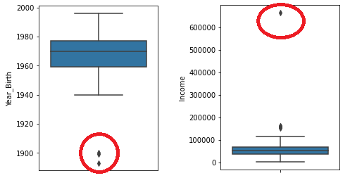

For Mnt (spending) columns mostly are distributed in positively skewed and need to transform in pre-processing step.

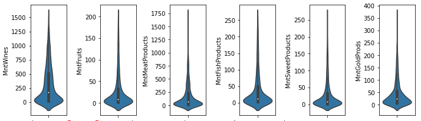

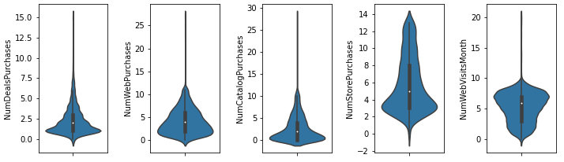

For categorical columns there are focused distribution of groups in Graduation education, Maried marital status, 0 Kidhome and Teenhome.

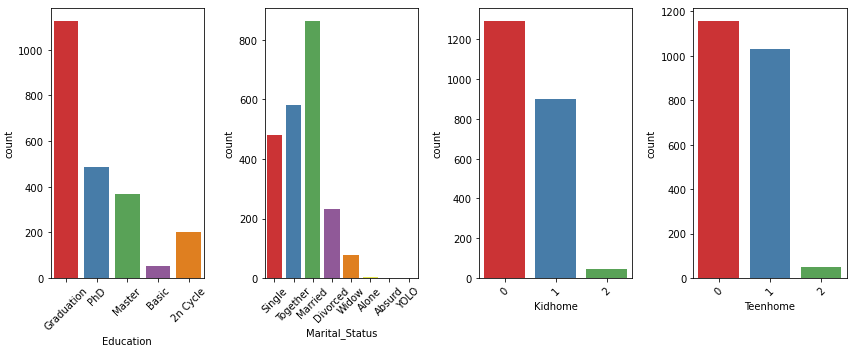

Target distribution (Response column) is not balanced it is mean that we need oversampling in pre-processing step to balance training data to avoid overfit/underfit.

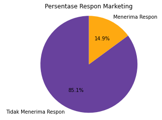

## Multivariate analysis
Correlation features to target are mostly weak it is indicate non linear relation model needed for this case.

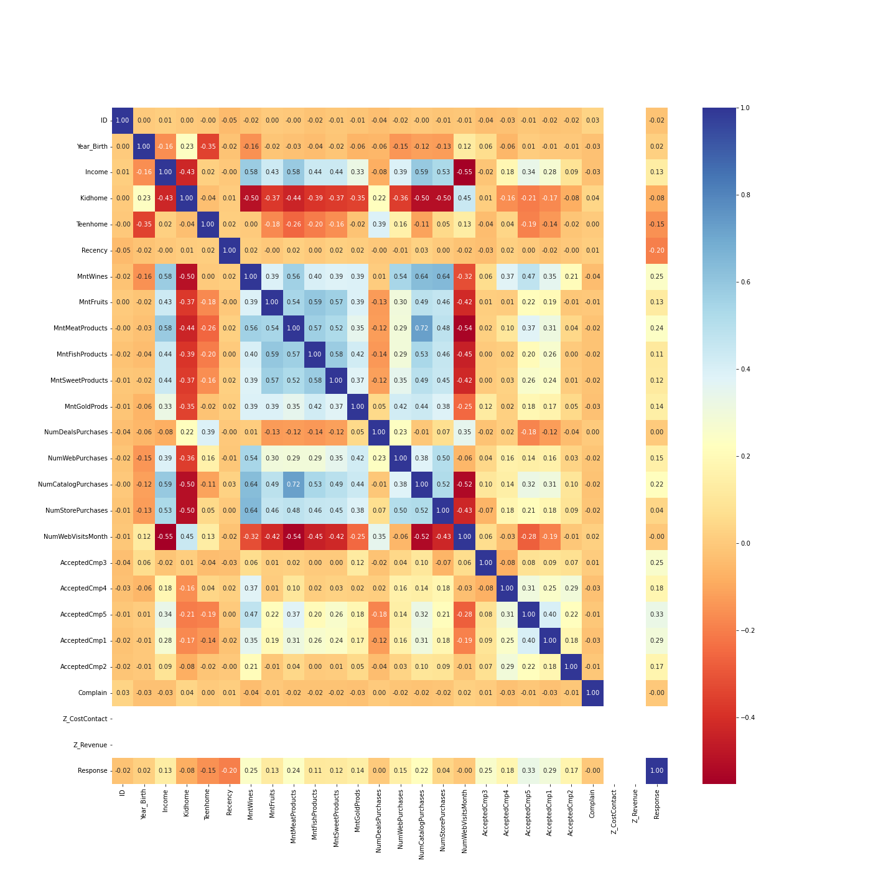

Distribution response in categorical feature. There are some pattern in kidhome and teenhome feature where less kid/teen is more chance to get response.

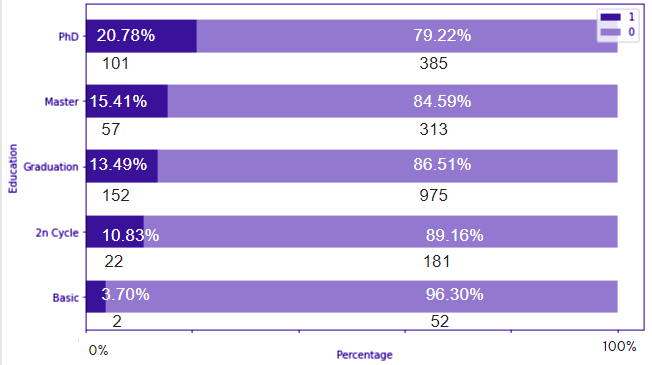
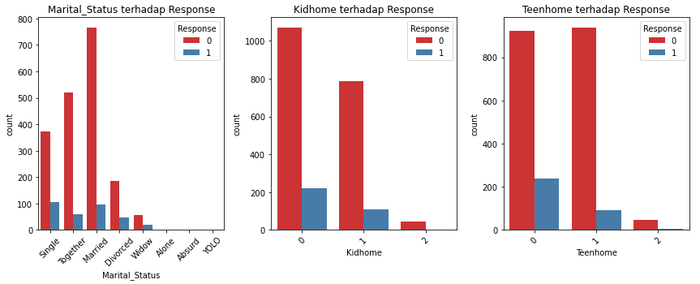

On numerical feature there are some difference distribution in response on some product and activity.

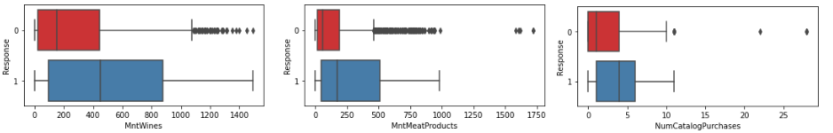

# Preprocessing
There are some process to prepare data for modelling needs.
1. Cleansing
    Remove missing value, duplicated values, outliers.
2. Encoding
    Encode categorical features.
3. Transformation
    Log transformation for Mnt (spending) features
4. Feature extraction
    Create new feature such as age, dependencies.
5. Class imbalance
    balance data with oversampling techique.


# Modelling & Evaluation
For this classification task model metric used is precision. Consideration this model metric are because we try to maximize reduce False Positive to increase response rate.
Model used in modelling step are : DecisionTree Classifier, RandomForest Classifier, XGB Classfier, LGBM Classifier, Logistic Regression. Model were tuning with some hyperparameter adjustment and this is the best 3 model.

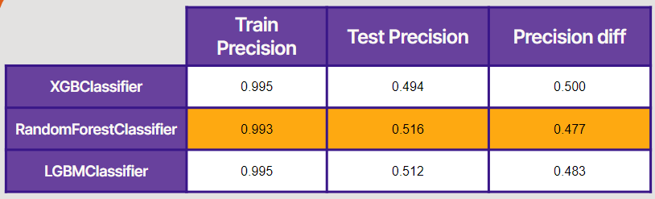

From model we generate feature importance.

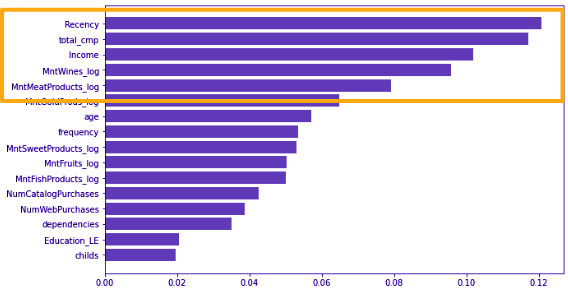

# Business Simulation & Insight

## Simulation
Simulation are used data from data test (X_test) in modelling. Disclaimer data size are different fromm 2240 (original data) and 103 (predicted 1 in data test). Response rate is increase to <b>51.61% and profit increase to $249.</b>
## Recommendation
There are some recommendation to incerase response rate. There are :
1. Targetted marketing
    There are some differet distributions in some feature that need to condisers as good target for increasing response.
    Good target are customer that have 0 - 20 recency or have total accepted campaign >= 2 or have income > 70,000.
   
    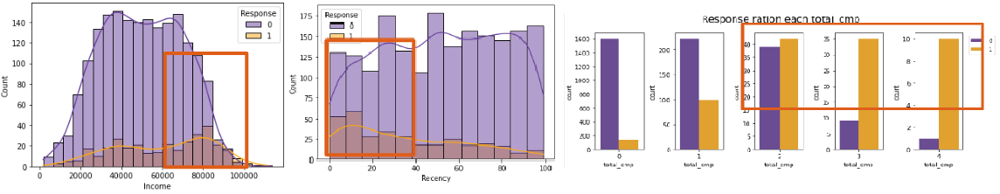
    
3. Discount
    Discount is an action to stimulate customer to keep buy a product under < 20 days so customer will attract to response to campaign.
   
    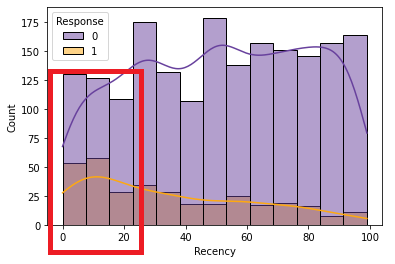
    
5. Product recommendation
    Recommend more product in meat and wines beacuse there are difference distribution in response.
   
    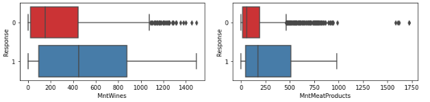


